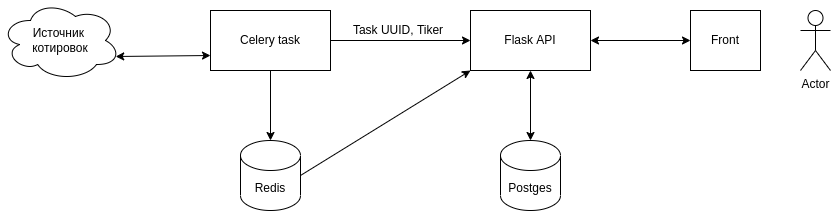

##  Seasonality calc API

## ТЗ

Написать python-скрипт, который будет читать историю цен, которую пользователь без навыков может легко обновлять. Обновление происходит через celery. Историю цен записывать в базу данных. Создать скрипт на flask, используя swagger, чтобы при обращении к странице сайта отрисовывался график истории цены и график сезонности цены внутри года.

Котировки для расчета сезонности в файле:
https://drive.google.com/drive/folders/1-CdTeL1S7eHvvJ_Tuyi5gWuXPNUm0VkW?usp=sharing

Таким образом,
1) на входе: файл с данными.
2) на выходе: график цены и сезонности.
3) условия: flask, swagger, celery. Все работает в docker контейнере.

## Решение

Документированное API http://localhost:5000/swagger/

Схема:



Так-как уточнения по ТЗ не добавили ясности, исходим из того, что celery требуется для выполнения задач по расписанию.
Скорее всего задачи связаны с обновлением списка истории котировок по дням.
Периодичность не указана, откуда брать котировки и в какую базу в каком формате записывать - тоже.
Celery в этой сборке берет данные каждую минуту с www.alphavantage.co по тикеру IBM. Записывает результат в Redis.
И извещает Flask API от том что таск с таким-то id готов для дальнейшей обработки.


Исходный csv перегоняется в Postgres при первом запуске сборки. Далее, обращение к эндпоинту http://localhost:5000/api/v1/history/seasonality
выдает json с расчетами сезонности за 5, 10, 15 лет по дням года и сезонность текущего года.
К сожалению формул и рекомендаций расчета сезонности ТЗ не содержит. Есть только ссылка на страницу сайта:
https://insider-week.com/en/seasonality/

## Для запуска

Получить ключ API - https://www.alphavantage.co/support/#api-key
Заменить API_KEY=XXXXXX на новый ключ в файле /celery_worker/.celer.env.example

```
git clone git@github.com:mechnotech/Seasonality.git
cd Seasonality
docker-compose -up -d
```

`docker logs celery` - для просмотра id тасков в консоли


